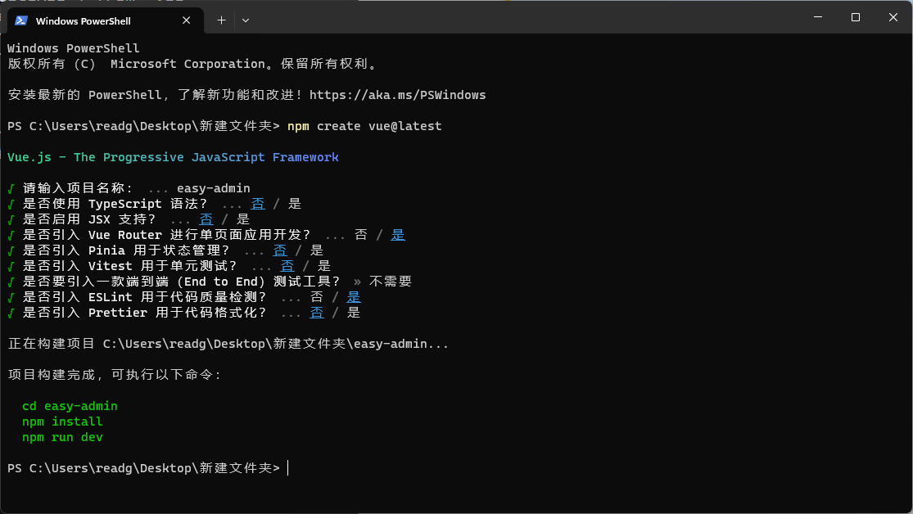
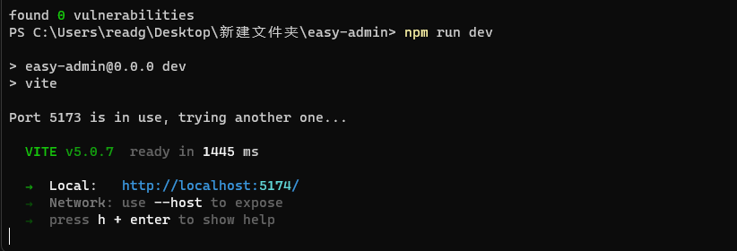
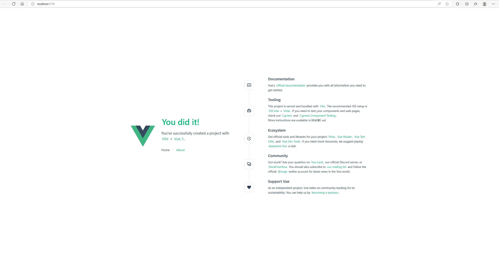
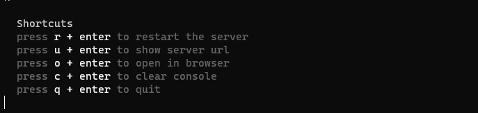

# easy-admin<br>
## 前言<br>
&emsp;&emsp;首先我并不是一个专业的前端开发人员，但由于在小厂工作很多时候不得不兼任一下前端的工作,之前一直使用ES5.1+jQuery。最近实在受不了JQ的数据交换逻辑，所以想寻求一种简单的框架进行替换。之前一直有关注过React,AngularJS，VUE，经过一番探索后，最后决定基于VUE进行开发。其实三个框架我觉得各有优缺点，区别不大。但VUE的中文支持好一些，官方网站不用魔法上网页能快速访问，加上element-plus的加持基本能满足我接触到的项目需求。这个开源项目旨在记录我都的学习过程，初步目的是部署一个基础的框架，欢迎大家交流学习。<br>
## 参考网址<br>
- [VUE官方文档](https://cn.vuejs.org/)<br>
 &emsp;&emsp;Vue 3 官方文档，因为Vue 2 将于 2023 年 12 月 31 日停止维护，所以选择Vue3<br>
- [element-plus官方文档](https://element-plus.org/zh-CN/)<br>
&emsp;&emsp;基于 Vue 3，面向设计师和开发者的组件库<br>
- [element-plus官方github](https://github.com/element-plus/element-plus)<br>
&emsp;&emsp;element-plus源码，有issue可以在此提交<br>
- [VITE官方文档](https://cn.vitejs.dev/)<br>
&emsp;&emsp;前端工具链，用于构建网站，调试，发布<br>
- [Vue3 One Piece](https://vue3js.cn/)<br>
&emsp;&emsp;由国内Vue爱好者共同搭建学习站点<br>
## 第一步创建项目<br>
&emsp;&emsp;安装Vue3,打开命令提示符或者PowerShell，输入以下命令<br>
```bash
npm create vue@latest
```
&emsp;&emsp;根据提示输出项目名称(比如easy-admin),选择需要安装的模块，我选择的是Router和ESLint<br>

<br>
&emsp;&emsp;然后等待项目构建完成，可执行以下命令：<br>
&emsp;&emsp;进入项目目录<br>
```bash
  cd easy-admin
```
&emsp;&emsp;安装依赖<br>
```bash
  npm install
```
&emsp;&emsp;等待运行结束，然后运行调试<br>
```bash
  npm run dev
```

<br>
&emsp;&emsp;这时候安装CTL键不放，点击窗口上的网址就能打开刚刚创建的网站了，如果无法打开也可以直接输出o然后按钮回车<br>

<br>
&emsp;&emsp;现在我们已经看到努力的成果了，是不是很方便！不过先别急，我们返回命令窗口，上面有一行“ press h + enter to show help”意思是输入h+enter显示帮助信息，输入后会得到以下的信息，这对我们调试很有帮助
<br>

&emsp;&emsp;接下来我们来翻译一下这几个快捷键
- r + enter 重启服务器，相当于刷新缓存
- u + enter 显示服务器地址
- o + enter 在浏览器中打开网址
- c + enter 清屏，清空控制台
- q + enter 退出，注意！如果直接关闭命令窗口，服务是不会停止的！
## 克隆项目
&emsp;&emsp;如果你想省去前面的步骤，并且跟我一样，只需Router和ESLint，可以通过git快速克隆项目<br>
```bash
git clone -b vue3 https://github.com/readgo/easy-admin.git
```